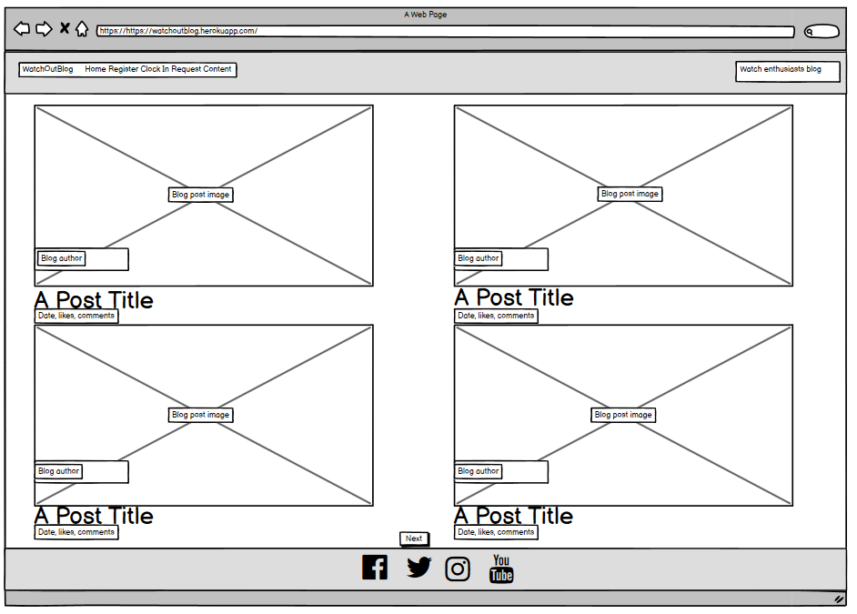
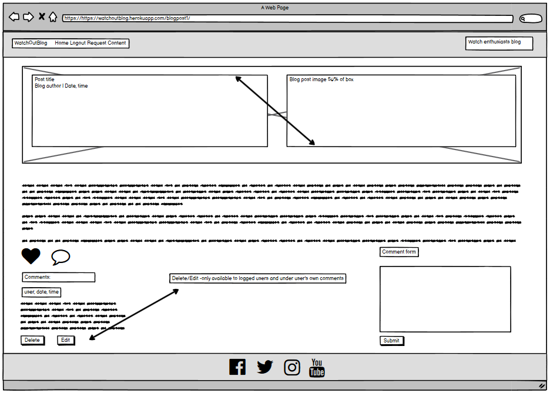
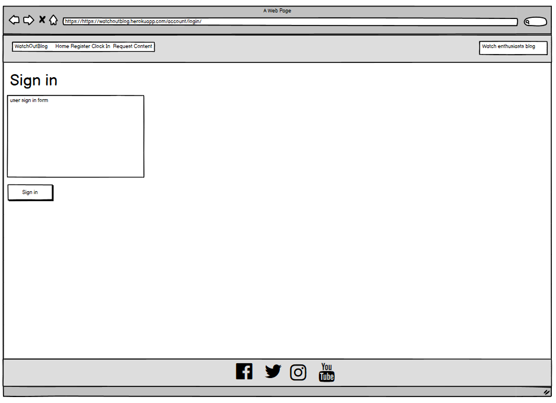

# WatchOutBlog 
Blog for watch enthusiasts created by watch enthusiast.

Please visit the blog in [here](https://watchoutblog.herokuapp.com/).

## Introduction and purpose

The WatchOutBlog has been developed as part of the Milestone project 4 for Code Institute Diploma in Software Development with eCommerce.
The WatchOutBlog is a website blog built in Django, incorporating Python, CSS and HTML.

The blog and its content, in terms of blog posts, is administered by WatchOutBlogger. The nature of the blog posts will be a mix of educational and brand review posts with the overall aim of creating engagement in the watch community across the globe.
The blog community may engage with the WatchOutBlogger as well as other blog users by creating comments under each blog post. Users may also like blog posts to express their interests in specific blog types. The engagement of the blog user is only possible post completion prior user registration process. 

## Design 

The below section of the document outlines development journey of the blog starting from the concept to ultimate solution used to develop the blog.

### 1 Concept

The overall concept was to develop a blog, which would be administered by its owner. The purpose was to provide educational and brand review blog posts.
Blog users would be invited to register and post completion registration process would be allowed to engage in community through blog posts comments and likes.

In order to appeal to users the blog needed to be visual, therefore homepage is diveded into 4 sections allowing for a good quality picture to give sense to a user in relation to nature of each blog post. In additionl each blog post has blog title associated as well as the date and time as to when it was created.
In order to give a sense of community engagement for each of the blog posts, each blog post on the homepage will also reflect numbre of likes and number of comments.

### 2 Functional scope 

In terms of overall functional scope the following 4 key areas were needed to be developed in order for the blog to operate as required:

**Blog administration** - blog owner to be able to create, post and manage respective blog posts. Blog owner shoudl be also able to manage user comments through approval and where required a deletion process.

**User administration** - blog users to be able to register and login in order to interact with the blogger and other blog users.

**User comments** - registered and logged blog users should be in position to comment on individual blog posts. Users should be also allowed to update and delete their own comments.
   
**User blog likes** - registered and logged blog users should be in position to like individual blog posts. The functionality shoudl also allow for blog users to reverse "a like" previously given to a particular blog post.

### 3 Solution 

In order to develop a website based blog, and given the functional needs the following solutions were used:

**Languagues**
Given the fact that nature of the application indicates a need for a frequent content manipulation, a standard HTML solution will not work.
The solution needed to incorporate Python in order to make the solution more agile, in terms of development of relevant functions and in order for the user actions to be able to interact with the database in place. 
As part of the development the following languages were used:
- HTML
- CSS
- Python

**Database**
The blog application required a database structure, which would support managing blogger's blog posts, storing relavant content and images.
The database also needed to store users information and their interactions with the blog through comments and likes.
For the purpose of managing database related needs, Postgresql was selected as a solution for this project.

The below reflects database schema developed in order to support the needs of this project.

DATABASE SCHEMA PLACEHOLDER

**Development**
For the purpose of development of this project a number of technologies were used. 
- GitHub respository was used to store the project's code after being pushed from Gitpod.
- Gitpod IDE was used for version control by utilizing the Gitpod terminal to commit and Push to GitHub.
- Django framework was used to develop structure of the blog and also to use some of the already developed functions of Django such as user authorisation, admin portal and others.
- Bootstrap5 was used for construction of the blog application and responsivness.
- Cloudinary was used for a purpose of managing images required for running the application.
- Summernote for the purpose of enhanced text editing when managing blog posts.
- Crispy forms library 
- DrawSQL was used for drawing database schema.
- Balsamiq was used for creation of wireframes during the initial design process.
- Google

**Deployment and application hosting**
The application has been deployed and it is hosted on Heroku.
The deployment process has been outlined in a more detailed manner in the latter part of this document.

### 4 Wireframes 

As part of the design process for this process a set of wireframes have been created using Balsamiq application.
The purpose of the wireframes below was to visualise indicatively the user experience, which the blog user will get once the application was fully operation.

The wireframing has been completed for desktop and mobile users.

**Desktop**

Homepage

Blog post, comment section and user comment form

User Sign up

User Login

Comment deletion

Comment update

**Mobile**

Homepage & Blog post, comment section and user comment form

                

User Sign up & User Login 

            

Comment deletion & Comment update

 

### 5 User stories

## User Experience Design  

## Features 

### Blog navbar

### Blog homepage

### Blog individual posts

### User comments 

### User comments deletion

### User comments update

### User notification messages

### User blog sign up

### User blog sign in 

### Blog administration

## Future developments

## Testing 
Throughout the course of testing the following key test areas were focused on:

**Functional**

**Responsive user experience**

**Code validator testing**

**HTML index file**

**CSS file**

**Lighthouse – Dev Tools**

**Bugs**

  **Fixed Bugs**
  

  
  **Unfixed Busg**
  

 
## Deployment 

## Credits

