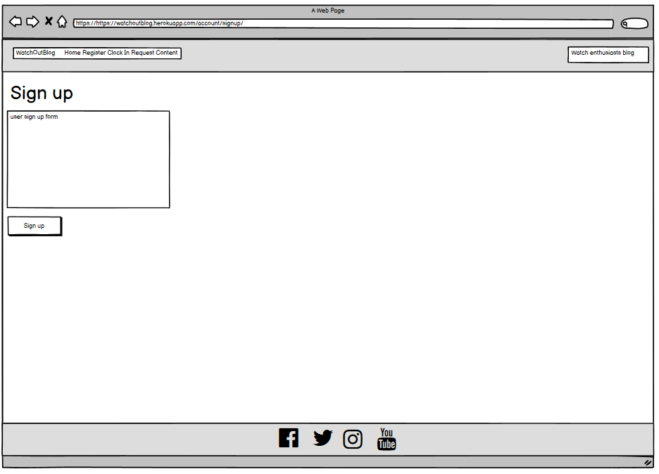
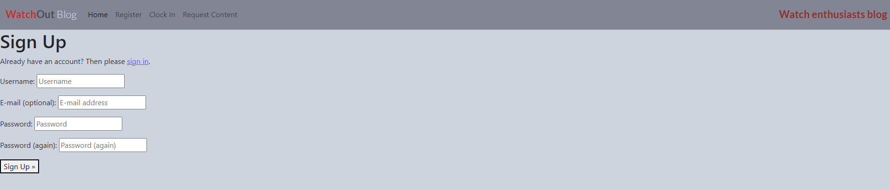
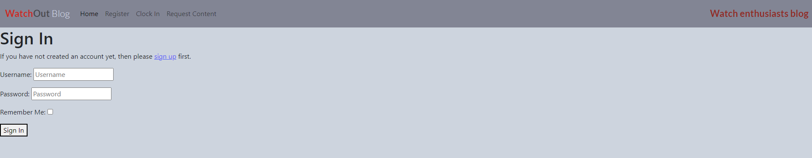

# WatchOutBlog 
Blog for watch enthusiasts created by watch enthusiast.

Please visit the blog in [here](https://watchoutblog.herokuapp.com/).

## Introduction and purpose

The WatchOutBlog has been developed as part of the Milestone project 4 for Code Institute Diploma in Software Development with eCommerce.
The WatchOutBlog is a website blog built in Django, incorporating Python, CSS and HTML.

The blog and its content, in terms of blog posts, is administered by WatchOutBlogger. The nature of the blog posts will be a mix of educational and brand review posts with the overall aim of creating engagement in the watch community across the globe.
The blog community may engage with the WatchOutBlogger as well as other blog users by creating comments under each blog post. Users may also like blog posts to express their interests in specific blog types. The engagement of the blog user is only possible post completion prior user registration process. 

## Design 

The below section of the document outlines development journey of the blog starting from the concept to ultimate solution used to develop the blog.

### 1 Concept

The overall concept was to develop a blog, which would be administered by its owner. The purpose was to provide educational and brand review blog posts.
Blog users would be invited to register and post completion registration process would be allowed to engage in community through blog posts comments and likes.

In order to appeal to users the blog needed to be visual, therefore homepage is diveded into 4 sections allowing for a good quality picture to give sense to a user in relation to nature of each blog post. In additionl each blog post has blog title associated as well as the date and time as to when it was created.
In order to give a sense of community engagement for each of the blog posts, each blog post on the homepage will also reflect numbre of likes and number of comments.

### 2 Functional scope 

In terms of overall functional scope the following 4 key areas were needed to be developed in order for the blog to operate as required:

**Blog administration** - blog owner to be able to create, post and manage respective blog posts. Blog owner shoudl be also able to manage user comments through approval and where required a deletion process.

**User administration** - blog users to be able to register and login in order to interact with the blogger and other blog users.

**User comments** - registered and logged blog users should be in position to comment on individual blog posts. Users should be also allowed to update and delete their own comments.
   
**User blog likes** - registered and logged blog users should be in position to like individual blog posts. The functionality shoudl also allow for blog users to reverse "a like" previously given to a particular blog post.

### 3 Solution 

In order to develop a website based blog, and given the functional needs the following solutions were used:

**Languagues**
Given the fact that nature of the application indicates a need for a frequent content manipulation, a standard HTML solution will not work.
The solution needed to incorporate Python in order to make the solution more agile, in terms of development of relevant functions and in order for the user actions to be able to interact with the database in place. 
As part of the development the following languages were used:
- HTML
- CSS
- Python

**Database**
The blog application required a database structure, which would support managing blogger's blog posts, storing relavant content and images.
The database also needed to store users information and their interactions with the blog through comments and likes.
For the purpose of managing database related needs, Postgresql was selected as a solution for this project.

The below reflects database schema developed in order to support the needs of this project.

**Development**
For the purpose of development of this project a number of technologies were used. 
- GitHub respository was used to store the project's code after being pushed from Gitpod.
- Gitpod IDE was used for version control by utilizing the Gitpod terminal to commit and Push to GitHub.
- Django framework was used to develop structure of the blog and also to use some of the already developed functions of Django such as user authorisation, admin portal and others.
- Bootstrap5 was used for construction of the blog application and responsivness.
- Cloudinary was used for a purpose of managing images required for running the application.
- Summernote for the purpose of enhanced text editing when managing blog posts.
- Crispy forms library 
- DrawSQL was used for drawing database schema.
- Balsamiq was used for creation of wireframes during the initial design process.
- Google

**Deployment and application hosting**
The application has been deployed and it is hosted on Heroku.
The deployment process has been outlined in a more detailed manner in the latter part of this document.

### 4 Wireframes 

As part of the design process for this process a set of wireframes have been created using Balsamiq application.
The purpose of the wireframes below was to visualise indicatively the user experience, which the blog user will get once the application was fully operation.

The wireframing has been completed for desktop and mobile users.

**Desktop**

Homepage

Blog post, comment section and user comment form

User Sign up

User Login

Comment deletion

Comment update

**Mobile**

Homepage & Blog post, comment section and user comment form

                

User Sign up & User Login 

            

Comment deletion & Comment update

 

### 5 User Stories

The development of the project was based on User Stories created for the purpose of this project. The User stories were created and managed through a Kanban board available in GitHub. 
There were total of 12 User Stories which had been completed as part of this development. The User Stories had been labelled according to reflect 3 catergories assigned such as: Must-Have, Should-Have and Could-Have. The progress in development was reflected in User Stories being moved from To Do, In Progress to Done section of the Kanban board. In addition to 12 User Stories aformentioned above, there were additionl 5 User Stories created and labelled as Won't-Have. These are related to future planned devlopments.

All of the User Stories for this project can be accessed [here](https://github.com/adamwasiak/WatchOutBlog/projects/2).

## User Experience

## Features 

The below illustrates features currently available to blog users.

### Blog navbar
User will find navigation bar, which features WatchOutBlog logo (acting as home buttom), Home, Register and Clock In (Sign in) buttons.

### Blog homepage
Homepage includes 4 blog posts, each of which can be clicked on in order to access entire blog post.

### Blog individual posts
Individual blog posts will host blog image, content and also reflect number of likes and comments under the blog post.

### User comments 
User comment section, under individual blog post, will allow user to read through the comments posted by other users.
Logged in users will be able to use comment form and post their own comment.If a logged in user has already posted before, they will see Delete and Edit icons next to their own comments, allowing for further action on these. The option of deleting or editing comments is exclusively available to logged in users and only for their own comments. 

### User comments deletion
Logged in users who have posted comments before, will be able to delete their own comments. Upon clicking Delete icon they user will be taken to a confirmation page to confirm deletion of their comment.

### User comments update
Logged in users who have posted comments before, will be able to update their own comments. Upon clicking Edit icon they user will be taken to a confirmation page to edit their own comment.

### User notification messages
There is set of user notifications available to blog users. Users who log in will receive a message confirming that they logged in. Similarily users who logout will receive a message that they are logged out. In addition user who post a comment under a blog post, will receive a message that their comment is subject to administrator's approval.

### Blog user sign up
New users will be able to register by creating their user name and also password.

### Blog user sign in 
Registered users are able to login in order to manage their comments and like posts.

### Blog administration
Blog administration in terms of blog posts, comments approval is managed by Django's admin portal.

## Future developments
The below outlines potential future developments in order to enhance user experience and to attract wider user base.

- **User blog collaboration** - complete development to allow registered users to create blog posts, subject to blog owner approval.
This would allow for a greater and more frequent content being added to the blog.

- **User comments with images** - complete development which would allow registered users to post comments along with images. This would allow a greater level of user engagement when discussing watch experiences.

- **Watch news** - complete development of additional page in the blog, which would pull watch related news from number of sources. This would further increase user engagement as the blog would become one stop for blog posts, discussion and also following on the latest watch news.

- **User emails** - create a email confirmation issued to newly registered users who opted to provide their email address.

- **Search option** - develop blog content search options which would allow users to search throughout the blog using keywords.

## Testing 
There has been an extenstive testing completed prior to final deployment.
The 3 key areas of testing were related to functional, resposive user experience and code validation.

**Functional**

The functional testing has been completed manually and the test scenarios and the test results have been captured in the document below.
The document breaks the test scripts into a number of functional group. Overall testing has been successful , with only 1 aspect being identified as an issue.
The issue has been noted in the unfixed bugs section below.

**Code validation testing**
The code itself was validated using HTML - W3C HTML Validator,CSS - Jigsaw CSS Validator and Python - PEP8Online.
Results have been outlined below

**HTML code validation**

The code validation process in HTML - W3C HTML Validator has provided the below results.

Base.html

Post_detail.html

The validation had highlighted bad value error, which upon further testing does not cause any functional or performance issues.
Due to time constraints the error will not be resolved prior to submission of this project.

Comment_confirm_delete.html

Comment_form.html

Login.html

Logout.html

Signup.html

**Python code validation**

The code validation process in PEP8Online has not highlighted any code errors.
The screenshots confirming validation outcomes may include some details of the code however none of this is confidential or something, which could pose security concern.

Admin.py

Apps.py

Forms.py

Model.py

Settings.py

Urls.py

Views.py

**CSS code validation**
The code validation process in Jigsaw CSS Validator has not highlighted code errors.

**Lighthouse – Dev Tools**

Lighthouse testing has been also completed for both, desktop and mobile.

*Desktop*

*Mobile* 

**Bugs**

 **Fixed Bugs**
 
 The following bugs have been identified and subsequently fixed in the course of the project development:
 
 - during intitial deployment to Heroku, the env.py file was placed in a sub folder preventing successful deployment of the application.
 
**Status: Resolved**
 
 - user sign up issues were experienced post application deployment as as a result of incorrectly split code lines in settings.py file.
 
**Status: Resolved**
  
- final development deployment to Heroku had experienced issues with application being built as a result of database settings value mismatch between Heroku and Git development environment. 

**Status: Resolved**
  
 **Unfixed Bugs**
 
 The following bug remains unfixed:
 
 - in the blog admin portal when trying to execute search, an error occurs and no search results are returned.
 This bug remains unfixed at this moment.

 
## Deployment 

The application was deployed in Heroku.

The following steps have been taken as part of Heroku deployment process:

- Log in to Heroku.
- From the main Heroku Dashboard page select 'New' and then 'Create New App'.
- Provide a project name - I selected Watchoutblog and select a suitable region, then select create app. The name for the app must be unique.
- This will create the app within Heroku and bring you to the deploy tab. From the submenu at the top, navigate to the resources tab.
- Add the database to the app, in the add-ons section search for 'Heroku Postgres', select the package that appears and add 'Heroku Postgres' as the database.
- Navigate to the setting tab, within the config vars section copy the DATABASE_URL to the clipboard for use in the Django configuration.
- In the django app repository create a new file called env.py - within this file import the os library and set the environment variable for the DATABASE_URL pasting in the address copied from Heroku. The line should appear as os.environ["DATABASE_URL"]= "database value from Heroku".
- Secret key also needs to be added in the env.py file and the same must be reflected in Heroku Config Vars with the name "SECRET_KEY". Env.py file must contain os.environ["SECRET_KEY"] = "secret key value ".
- In Heroku, add the CLOUDINARY_URL and add related value as it was set up in Env.py file. (following earlier Cloudindary setup)
- Once all the Config Vars are correctly configured and aligned with repository, go to Deploy tab in Heroku. In this section Github repository can be connected to. Once connected, the deployment can be initiated by clicking on Deploy Branch. 
- The process of building the application will be visible to a user in Heroku’s UI and any potential issues will be flagged.
- Once the build is completed Heroku will confirm completing the task.

This project's initial deployment was completed by connecting to Heroku via Gitpod. This was completed by using “heroku login -I” command, entering Heroku credentials and subsequent push to Heroku. (using command “git push heroku main”).

## Credits

-Images and text content credits related to Blog posts:

- Blog post- Fossil- budget alternative?

   Image credit: https://unsplash.com/@fabianheimann

   Text content credit: Wikipedia

- Blog post- Seiko- timepiece of Japan?

   Image credit: https://unsplash.com/@notafraid
   
   Text content credit: Wikipedia

- Blog post- Arbre - new in the market?

   Image credit: https://unsplash.com/@klickors

   Text content credit: https://www.arbrewatches.com/AboutUs-British-London-England-UK-unitedkingdom

- Blog post- Felippe - any idea what it is?

   Image credit: https://unsplash.com/@philgmonte
   
   Text content credit: Wikipedia

- Blog post- Orient - another Japanese brand

   Image credit: https://unsplash.com/@notafraid

   Text content credit: Wikipedia

- Blog post- Bulova - worth considering?

   Image credit: https://unsplash.com/@rymrtn

   Text content credit: Wikipedia

-The project idea and concept was influenced by Code Institute's "I think therefore I Blog " tutorial.

-Thanky you to Code Institute for excellent module content, Code Institue support team and my mentor Daisy for guidance and support.

